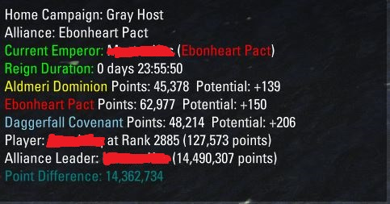

# Ranckors Leaders Board Tracker

    

### View your Allance Score information for you HOME Campaign.
    * For this addon to work you first need to assign a home campaign for your character.
        ** Navigate to the Alliance War window scene
        ** Navigate to the Campaigns tab
        ** Select a Campign under the Cyrodiil heading
        ** Right click on a Server
        ** Click on Home to assign your Home Campaign

Once you enter into Cyrodiil & get some Alliance Points you will score on the leaderboard.
The Points difference between you and the player in 1st place in your alliance will be calculated. This will then tell you how many points you need to gain before being level with your Alliance Leader.

As a whole this will track Your:
- Home Campaign
- Your Character Alliance
- The Current Emperor and their Reigning time
- The Alliance Scores for the current Campaign and their projected additional points the next server tick
- The player's Character (Name, Rank & Points)
- The character's Alliance Leader & Points
- The Points difference between your Alliance leader & your character

The UI Window can be relocated to your liking by drag & drop to the place you would prefer. This is a unique setting per character.

#
> This Add-on is not created by, affiliated with or sponsored by ZeniMax Media Inc. or its affiliates.
> The Elder Scrolls® and related logos are registered trademarks or trademarks of ZeniMax Media Inc. in the United States and/or other countries.
> All rights reserved.

> You can read the full terms at https://account.elderscrollsonline.com/add-on-terms

> Report & Submit your bugs and feature requests [Here](https://illyriat.com)